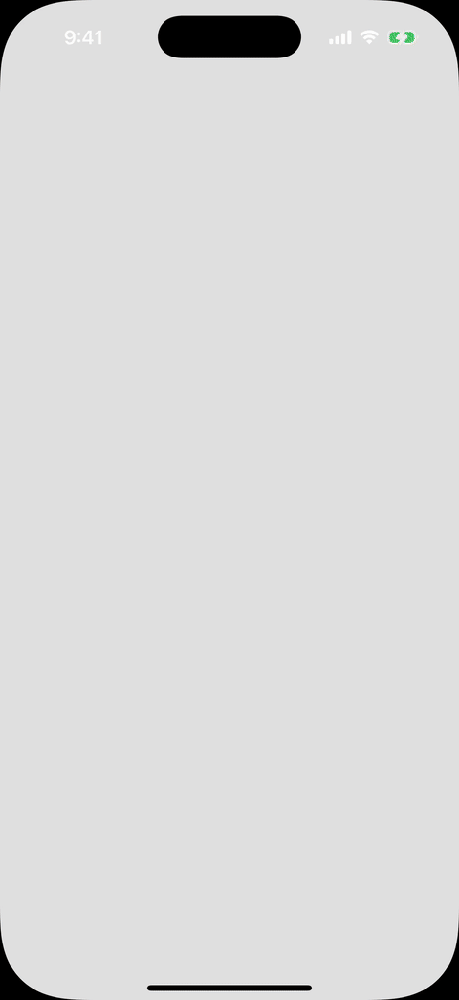

# capacitor-oidc

[](https://www.npmjs.com/package/capacitor-oidc)
[](https://github.com/jojopirker/capacitor-oidc/actions/workflows/ci.yml)
[](LICENSE)

`capacitor-oidc` is one OAuth 2.0 and OpenID Connect client for Capacitor web,
iOS, and Android applications, powered by
[`oidc-client-ts`](https://github.com/authts/oidc-client-ts). It uses
Authorization Code Flow with PKCE, native system authentication UI and secure
storage on mobile, and standard browser navigation and storage on web.

## Why `capacitor-oidc`?

- Simple standards-based OAuth 2.0 and OIDC for Capacitor, without
  provider-specific SDKs.
- One manager and configuration contract across web, iOS, and Android.
- The familiar `oidc-client-ts` `UserManager` API, session objects, and events.
- System authentication UI instead of an embedded WebView.
- Secure native storage for OIDC transactions and sessions.
- Refresh-token renewal when the app is active or resumes.
- A native-readable session snapshot for app widgets.

On iOS, authentication uses `ASWebAuthenticationSession`. On Android, it uses
AndroidX Auth Tab with its Custom Tab fallback.

## Compatibility

| Target    | Support                                      |
| --------- | -------------------------------------------- |
| Capacitor | 7 and 8                                      |
| iOS       | 15 or newer; `ASWebAuthenticationSession`    |
| Android   | API 24 or newer; Auth Tab or Custom Tab      |
| Flow      | Authorization Code Flow with PKCE            |
| Providers | Compatible OAuth 2.0 and OpenID Connect APIs |
| Web       | Redirect or popup navigation                 |

## Demo

This example signs in against a local Keycloak realm with Authorization Code
Flow and PKCE, renews the session through its refresh token, and signs out at
the provider.

[](https://jojopirker.github.io/capacitor-oidc/)

## Requirements

- Capacitor 7 or 8
- iOS 15 or newer
- Android API 24 or newer
- Android compile SDK 36, Java 21, and a compatible Android Gradle Plugin
- an OAuth public client using Authorization Code Flow with PKCE
- Web Crypto in every target runtime
- CORS support for web application and Capacitor origins on OIDC HTTP endpoints

Never ship a client secret in a Capacitor application.

## Install

```sh
npm install capacitor-oidc @capacitor/app
npx cap sync
```

## Quick start

```ts
import { CapacitorUserManager } from 'capacitor-oidc';

const manager = await CapacitorUserManager.create({
  common: {
    authority: 'https://identity.example.com',
    client_id: 'public-app',
    scope: 'openid profile offline_access',
    automaticSilentRenew: true,
    revokeTokensOnSignout: true,
  },
  web: {
    settings: {
      redirect_uri: `${window.location.origin}/callback`,
      post_logout_redirect_uri: `${window.location.origin}/logout-callback`,
    },
  },
  native: {
    settings: {
      redirect_uri: 'com.example.app:/callback',
      post_logout_redirect_uri: 'com.example.app:/logout-callback',
    },
    options: { storageNamespace: 'primary' },
  },
});

await manager.signin();
const validUser = await manager.getValidUser(30);

await manager.signout();
await manager.dispose();
```

Register every configured redirect and post-logout redirect URI exactly at your
provider, and register the native schemes in each native application. On the web
callback route, call `signinCallback()`; on the web logout callback route, call
`signoutCallback()`. The package detects the runtime and applies `common`, then
`web` or `native`, then the matching `ios` or `android` override.

A runnable Keycloak-backed iOS application and its UI test live in
[`example`](example/).

## Documentation

- [Getting started](https://jojopirker.github.io/capacitor-oidc/docs/GETTING_STARTED)
- [iOS and Android setup](https://jojopirker.github.io/capacitor-oidc/docs/PLATFORM_SETUP)
- [Provider configuration](https://jojopirker.github.io/capacitor-oidc/docs/PROVIDERS)
- [API and `oidc-client-ts` compatibility](https://jojopirker.github.io/capacitor-oidc/docs/API)
- [Sessions, secure storage, and widgets](https://jojopirker.github.io/capacitor-oidc/docs/SESSIONS_AND_WIDGETS)
- [Troubleshooting](https://jojopirker.github.io/capacitor-oidc/docs/TROUBLESHOOTING)
- [Testing status](https://jojopirker.github.io/capacitor-oidc/docs/TESTING)
- [Security](https://jojopirker.github.io/capacitor-oidc/SECURITY)

## Development

```sh
npm run verify
npm run verify:ios
npm run verify:android
```

Architecture decisions and contributor constraints are documented in
[ARCHITECTURE.md](ARCHITECTURE.md), [REQUIREMENTS.md](REQUIREMENTS.md), and
[docs/adr](docs/adr/).

## License

Apache-2.0
